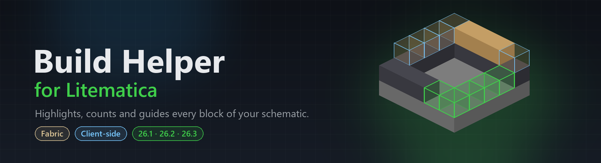

  

  
  
  
  
  

  <b>An unofficial client-side addon for <a href="https://github.com/maruohon/litematica">Litematica</a> that helps you build a schematic by hand.</b> 
  It shows where the block in your hand goes, what is left, what to place next and what to grab from your chests.

  <a href="#-features">Features</a> •
  <a href="#-installation">Installation</a> •
  <a href="#%EF%B8%8F-hotkeys">Hotkeys</a> •
  <a href="#-languages">Languages</a> •
  <a href="#-compiling">Compiling</a>

> [!NOTE]
> Build Helper for Litematica is not affiliated with or endorsed by masa or the Litematica project.

---

## ✨ Features

### 🟩 Held block highlight
Hold a block from the schematic and every spot where it still needs to be placed lights up green, even through walls.
Blocks you ignored in the Litematica material list are left out.

### 📊 Info panel and progress
A small panel shows the block in your hand, how many are left, how many you carry (shulker boxes included) and whether that is enough.
Progress bars follow the Litematica render layers, so you always see the current layer and the whole schematic.
Wall, fence and pane connections that the game changes on its own are counted as correct.

### ⬆️ Auto next layer
In single layer mode the render layer moves on as soon as the current layer is complete.
Empty and finished layers are skipped and it stops at the last layer of the schematic. The direction can be up or down.

### 🔢 Block order
When you are not holding a needed block, the panel suggests what to place next and where it is in your inventory.
Let it pick the most needed block automatically, or set your own order for every layer with the arrows.

### 📦 Container highlight
Open a chest, barrel or shulker box and the items you need are outlined:

| Outline | Meaning |
| :---: | --- |
| 🟩 | Used in the build as it is |
| 🟨 | Can be crafted, cut or smelted into a needed block, for example logs into stairs |

The tooltip shows the item id, how many are needed and what the item turns into, with an estimate of how many you need.
Recipes are read from the game itself, so it also works on servers and Realms.

### 🤖 Auto place
Places the block in your hand into the green highlighted spots within reach, facing the right way.
Stairs, slabs, logs, trapdoors and other directional blocks are placed in the correct state, and wooden doors, trapdoors and fence gates are opened when the schematic wants them open.
Spots it cannot place correctly are skipped, and it stops when the block in your hand runs out.
The speed can be set from 1 to 200 blocks per second, and it can be limited to only work while sneaking.

> [!CAUTION]
> Auto place is off by default. Many servers do not allow automatic block placement, so only use it in your own world or Realm.

---

## 📥 Installation

1. Install [Fabric Loader](https://fabricmc.net/use/) for your Minecraft version.
2. Put **Litematica**, **MaLiLib** and the matching **Build Helper for Litematica** jar in your `mods` folder.
3. Start the game, load a schematic and hold one of its blocks.

| Minecraft | Build Helper jar | Litematica | MaLiLib |
| --- | --- | --- | --- |
| 26.3 | `buildhelper-litematica-fabric-26.3-*.jar` | 26.3 | 26.3 |
| 26.2 | `buildhelper-litematica-fabric-26.2-*.jar` | 0.28.8+ | 0.29.6+ |
| 26.1 – 26.1.2 | `buildhelper-litematica-fabric-26.1.2-*.jar` | 0.27.14+ | 0.28.12+ |

Downloads are on the [releases page](https://github.com/LwozR/build-helper-for-litematica/releases).

---

## ⌨️ Hotkeys

| Hotkey | Action |
| --- | --- |
| `M` + `B` | Open the settings |
| `M` + `O` | Open the block order of the current layer |
| *(none)* | Auto place on/off, set it in the settings |

Every feature can be turned on or off, and hotkeys, panel position, scale and colors can be changed in the settings.
The settings are also available through [Mod Menu](https://modrinth.com/mod/modmenu).

---

## 🌍 Languages

The mod follows the game language.

English · Türkçe · Deutsch · Español · Français · Português (Brasil) · Русский · Українська · Polski · Italiano · 简体中文 · 繁體中文 · 日本語 · 한국어

---

## 🔨 Compiling

* Clone the repository
* Open a command prompt/terminal to the repository directory
* Run `gradlew build`
* The built jar file will be in `build/libs/`

Each Minecraft version has its own branch: `main` (26.3), `26.2` and `26.1`.

---

## 📄 License

[LGPLv3](LICENSE), the same as Litematica and MaLiLib.
